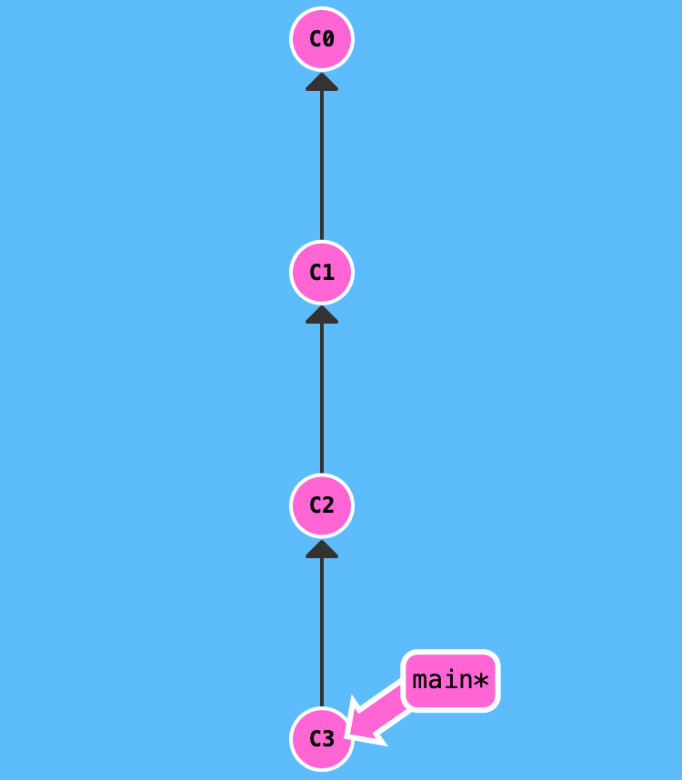
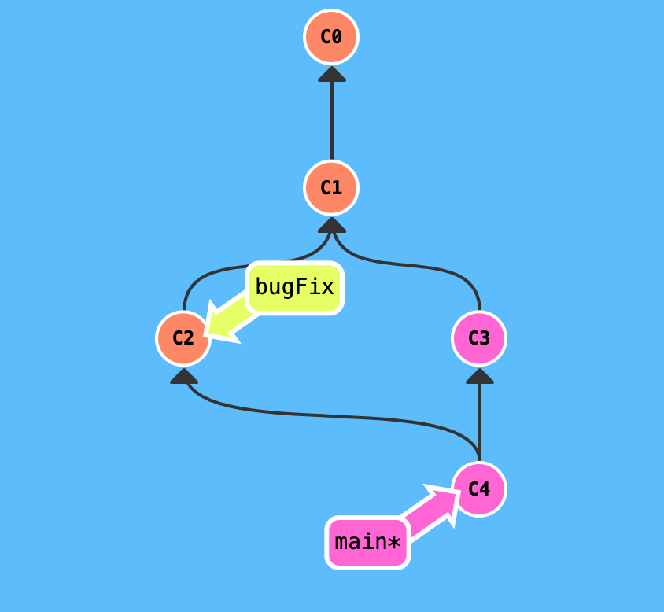

# Что такое Git и зачем он нужен?

Git - это консольная утилита, для отслеживания и ведения истории изменения файлов, в вашем проекте. Чаще всего его используют для кода, но можно и для других файлов. Например, для картинок - полезно для дизайнеров.

С помощью Git-a вы можете откатить свой проект до более старой версии, сравнивать, анализировать или сливать свои изменения в репозиторий.

Репозиторием называют хранилище вашего кода и историю его изменений. Git работает локально и все ваши репозитории хранятся в определенных папках на жестком диске.

 Так же ваши репозитории можно хранить и в интернете. Обычно для этого используют: https://github.com/

Каждая точка сохранения вашего проекта носит название коммит (commit). У каждого commit-a есть hash (уникальный id) и комментарий. Из таких commit-ов собирается ветка. Ветка - это история изменений. У каждой ветки есть свое название. Репозиторий может содержать в себе несколько веток, которые создаются из других веток или вливаются в них.

## Как работает

Если посмотреть на картинку, то становиться чуть проще с пониманием. Каждый кружок, это commit. Стрелочки показывают направление, из какого commit сделан следующий. Например C3 сделан из С2 и т. д. Все эти commit находятся в ветке под названием main. Это основная ветка, чаще всего ее называют master . Прямоугольник
main показывает в каком commit мы сейчас находимся, проще говоря указатель.

В итоге получается очень простой граф, состоящий из одной ветки (main) и четырех commit. Все это может превратиться в более сложный граф, состоящий из нескольких веток, которые сливаются в одну.

Об этом мы поговорим в следующих статьях. Для начала разберем работу с одной веткой

# подсказки по командной строке

Команда отображения текущей директории

Ваш код здесь

# Первый файл по контолю версий

## Первый файл по контолю версий

Hello_world!

*курсив*

**Полужирный.**

* раз
* два

1. перевый элементы нумеровонного списка
2. второй элементы нумеровонного списка

Начинаем наше знакомство с контролем версий.
